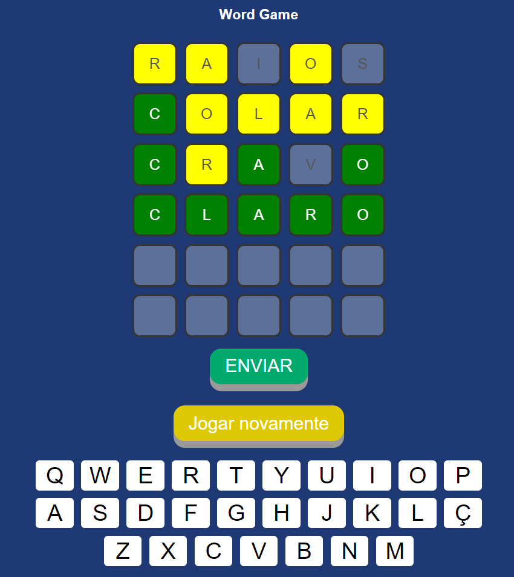

# My Termo

This is my first personal project, without using frameworks.It's based on the game TERMO, which consist of guessing the word, based on the position of the letters derived from an input word.

## Index

- [Installation](#installation)
- [Running](#running)
- [Contribution](#contribution)
- [Contact](#contact)

## Installation

Download and install the necessary software for execute the project in browser:

Xampp download (Apache server): https://www.apachefriends.org/pt_br/download.html

OR


Nginx download: https://nginx.org/en/download.html

```bash
# Clone the repository
git clone https://github.com/felipecr-12/word-game

# Move project for the xampp/nginx path
mv word-game C:/xampp/htdocs/
```

# Install dependencies (Windows)
PHP 7.x/8.x: https://www.php.net/downloads.php

## Running

To run the project, start the Apache or Nginx server through XAMPP. Open your web browser and navigate to http://localhost/word-game.



## Contribution

For contributing in the project:

1. Take a fork of project
2. Create a new branch (`git checkout -b feature/new-feature`)
3. Commit your changes (`git commit -am 'Add new feature'`)
4. Push for branch (`git push origin feature/new-feature`)
5. Open pull request

## Contact

if you have a question or suggestion...

- Name: Felipe Rambor
- LinkedIn: [Seu LinkedIn](linkedin.com/in/felipe-rambor-a53a961b5)
